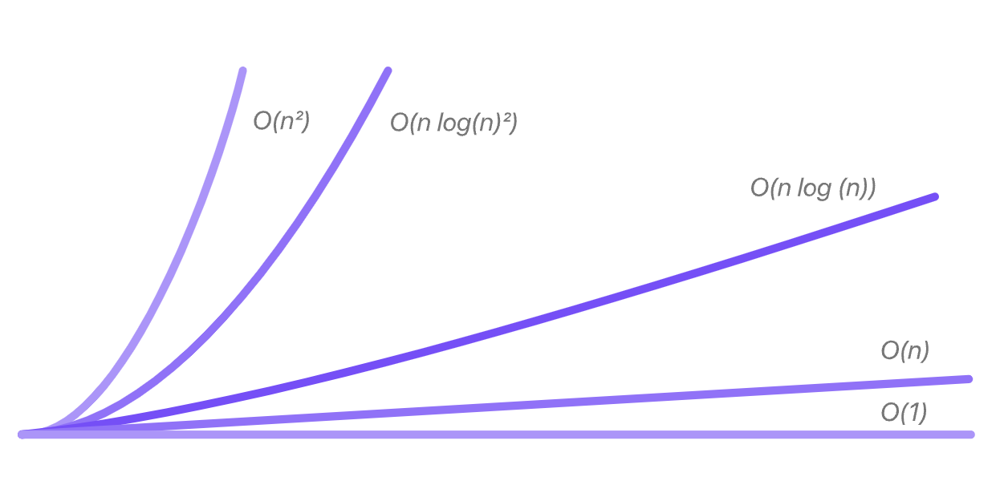

  

# 
CS499 - Computer Science Capstone

## 
Southern New Hampshire University

### 
My Professional Self Assessment

My name is Miguel Little. At 24 years old, I run a marketing agency with my brother and have a passion for Photography. I've been pursuing a degree in Computer Science for over 5 years and am looking forward to taking the next career steps available to me.
Here at Southern New Hampshire University I have learned many skills, both technical and practical. Studying Computer Science has not always been the easiest for me, but it has taught me how to overcome problems and how to learn and implement new abilities and skills. My CS-330 Computer Graphics and Visualization course was my hardest course to date, I had a hard time getting used to OpenGL. In that course I had to create a 3D environment that mirrored a photo I took of three objects. Through all of the struggle in that class I was finally able to learn how to create the environment. That class helped me to apply skills needed in this industry, from the technical coding skills to the practical skills such as thinking outside the box, learning and planning before executing, and enjoying the challenges while pushing through. My CS-260 class really helped me to develop my skills in software engineering, as well as how to work with data structures and algorithms. I also took DAD-220 which focused on databases and taught me how to sort and display data, that helped me with the enhancements I have made in this ePortfolio. My CS-310, Collaboration and Team Project course helped me learn to collaborate in team environments by understanding how companies plan and push changes in code to organizational repositories.

My artifact for my ePortfolio was a Bid Sorting application, and the enhancements I made to it showcased my skills in software engineering/design, data structures, algorithms, and databases. Making security-based changes to this project was one of the most difficult phases. I hit many roadblocks while implementing my planned enhancements, I accidentally added an underscore to <code>_append</code> and the updated library broke the code, which took me forever to notice. Pushing through each roadblock as I came to them taught me what it will be like to have a career in Computer Science. 

Honestly, I was unsure if I was even going to be able to finish this degree when I first started at SNHU. Time and time again I'd get stuck and feel an underlying motive to give up. Showing up everyday and giving it my all has taken me this far, and I won't be giving up that quality for anything.

This ePortfolio is part of my Computer Science Capstone course, in it I will showcase a summary of all my core skills in each category (Categories: Software Design/Engineering, Data Structures and Algorithms, Databases, Security). First I will perform an in-depth code review of my original artifact, then I will Enhance it in three phases with narratives. The Bid Sorting application I chose was created in C++. It was the perfect project to enhance, as I could enhance it in each category and make it a better application as a whole. I was able to enhance its design, improve the data structures and algorithms, and add a database that applied secure practices. Each of those categories were completed by re-engineering the application, modularizing it and implementing efficient sorting algorithms and time complexity, and attaching a database using SQL Lite.

### *Code Review*

Why conduct Code Review?
Whether the project is large scale or a small project, code review should be a non-negotiable step in the process. The purpose of code review is to at least verify that the code is functional, well-structured, free of bugs and logic errors, and secure. When conducting a deeper code review process, each step is reviewed in more detail; the design is checked to make sure it doesn't only follow coding standars, but also is consistent, reusable, non-repetitive, efficient, and doesn't consist of redundant code. Once the structure is reviewed, the code is checked for proper comments and documentation, proper variable usage and creation, the loops and branches are checked to make sure each line is properly nested, the code is checked for rounding errors, defensive programming methods are checked, and so on. All of these are examples of what a thorough code review should look like. If this process is skipped, an application will have many bugs, errors, messy code, and will be vulnerable to cyber attacks.

Below this paragraph is a video of the code I reviewed before making enhancements. In this review I go over the functionality of the original code's sstructure, logic, efficiency, functionality, security, documentation, and list ways it can be improved. In my review, I make mention of each of my planned enhancements and how they will meet the five course outcomes accross the three categories while reviewing each point.

Click [HERE](https://drive.google.com/file/d/1Wbz0zFgD8CoNAkRwpnA0gpTpmdjPFkHz/view?usp=drive_link) to watch the code review video.

## 
ORIGINAL ARTIFACT

The artifact project I made enhancements to is a C++ Bid Sorting project. This project has a basic terminal interface where users can enter numbered options to display bids from a local CSV file and sort them using sorting algorithms. I selected this project as my artifact since it had room for improvement throughout each category. The code didn't have a variety of sorting algorithms, a proper GUI, the option to insert, a database, time complexity, and the code was messy in general. My plan was to convert this code to a Python application to optimize each of those areas, make the code modular, and enhance the overall user experience and potential implementation of this application.

Here is the original terminal interface for the application:

View the original artifact code [HERE](https://github.com/mlittle7730/mlittle7730.github.io/tree/Vector-Sorting).

## 
ENHANCED ARTIFACT

This is my Python Application GUI after all of the changes have been made to meet all of the three categories. The GUI is visually appealing and has radio select buttons that a user can submit to display the bids from the CSV file and database, sort them by a few different parameters, add bid entries which opens another box, and close the application with the X instead of a input.

Here is the GUI for this application:

View the Artifact code [HERE](https://github.com/mlittle7730/mlittle7730.github.io/tree/Gov-Bids-Application).

### 
Meeting Each Category

### *Software Design and Engineering*

I enhanced the Software Design and Re-engineering this artifact by converting it from a C++ project to a Python application. This application loads bid data from a CSV file and uses sorting algorithms to sort those bids by different parameters. When it was a C++ project the program would launch in a terminal window that was not visually pleasing. Now the project loads a GUI that uses radio select buttons and a submit button to display the data in an organized column using tkinter. Since the application was solely driven by functions in the main file when built in C++, I then made it modular by creating classes for the functionality.

View my narrative for this enhancement [HERE](https://github.com/mlittle7730/mlittle7730.github.io/blob/Narratives/Software%20Engineering%20and%20Design%20-%20Narrative.pdf).

### *Algorithms and Data Structures*

I then enhanced the Algorithms and Data Structures in this artifact by first implementing something that could measure the time complexity when sorting algorithms so that it displays how long it took to sort the data by parameters. Each sorting function displays which algorithm was used and how long it took. To test different algorithm complexity, I added a new algorithm for sort by title using Bubble sort, and created a radio select button for it ("Bubble Sort by Title"). I listed the best, average, and worst case scenarios for each of the algorithms. For reference here are the scenarios for the bubble sort algorithm, where N is the number of items in the data it's sorting.

<code><a href="https://big-o.io/">Image Source</a>.</code>

Merge sort and Heap sort are some of the best algorithms running in this project. To continue my enhancements, I implemented error handling protocols, utilized different sorting algorithms for each radio select function, and created unit tests for the input fields.

View my narrative for this enhancement [HERE](https://github.com/mlittle7730/mlittle7730.github.io/blob/Narratives/Data%20Structures%20and%20Algorithms%20-%20Narrative.pdf).

### *Databases*

Lastly, I added a Database to this artifact using SQL Lite. I wanted the user to be able to add bids to the list, since it is pretty useless otherwise. By adding a database to this application to hold the added bids, the project will now store the information and not lose it after it is closed. The user can now load the bids from the database with or without the data from the CSV data, and sort through the data as usual.

There are error handling protocols in place for the insert bids function, a user has to implement a unique number for the bidID, a REAL number for the bid amount, and a date with the format DD/MM/YYYY for the closing date field.

View my narrative for this enhancement [HERE](https://github.com/mlittle7730/mlittle7730.github.io/blob/Narratives/Data%20Structures%20and%20Algorithms%20-%20Narrative.pdf).

### 
Meeting Each Course Outcome

### *Outcome 1*

I employed strategies for building collaborative environments by pushing my code to a git repository. I also met this course outcome by reviewing the code and applying changes where needed through the review process and commenting out each new change. I also Modularized the code, since it is now running through an object oriented design, other coders can easily jump in and add new functionality. I listed TO-DO's each time I was going to start and each time I finished a session of updates for the code, this way if changes are being integrated throughoutn the code, team memebers can build onto it.

### *Outcome 2*

I have designed, developed, and delivered quality oral, written, and visual communications by creating the Python application, a nice GUI to accompany it, and adding sorting algorithms. The application sorts by parameters and implements bubble sort in one of the sorting options as well. Adding a database that implemented the attributes in the proper columns was also important. I included a README file in the repository stored final project to explain changes. Doing all of these changes met Outcome 2.

### *Outcome 3*

I designed and evaluated computing solutions that solved given problems using algorithmic principles by implementing sort by parameter functions within the code. Users can now sort through the data provided within the CSV file and the database. I also met this course outcome by recreating each algorithm and function in a Python application rather than C++ which showed my ability to translate code to a different language. I also implemented bubble sort as an additional algorithm for another sorting option. I've made sure to keep computer science practices and standards in mind as a priority when creating each function, variable, and organizing the program, therefore all is named properly. The design is a lot nicer using a GUI instead of commandline for the application.

### *Outcome 4*

I demonstrated an ability to use well-founded and innovative techniques, skills, and tools while also meeting industry-specific goals meet this course by creating the classes to modularize the code, utilizing sort functions by parameters, and setting up the GUI using event handlers for the radio select buttons. Implementing algorithms and modularizing the code ensured I am meeting industry-specific goals as this is a very common implementation in the industry. I also made sure to comment out changes and create a readme file to meet this outcome further.

### *Outcome 5*

I made sure to meet this course outcome by hosting the database locally so that the code is automatically secure. I have also commented out every part of the code and made sure deallocation is in place.
